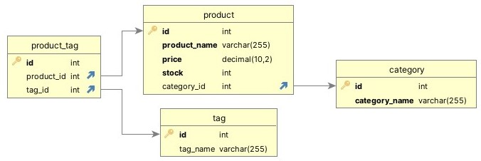

# Robs-E-Commerce-API-Database-Handling

[](https://opensource.org/licenses/MIT)

## Description

This repository was created as a part of the University of Richmond's Bootcamp, Module 13 Challenge. This application is a demonstration of how a server can be utilized to define API routes to create, update, and delete data in a database.

The following node modules are utilized in the deployment of this project:
`Express, MySQL2, Sequelize, dotenv`

The following User Story and Acceptance Criteria were provided for this challenge:

>## User Story
>
>```md
>AS A manager at an internet retail company
>I WANT a back end for my e-commerce website that uses the latest technologies
>SO THAT my company can compete with other e-commerce companies
>```
>
>## Acceptance Criteria
>
>```md
>GIVEN a functional Express.js API
>WHEN I add my database name, MySQL username, and MySQL password to an environment variable file
>THEN I am able to connect to a database using Sequelize
>WHEN I enter schema and seed commands
>HEN a development database is created and is seeded with test data
>WHEN I enter the command to invoke the application
>THEN my server is started and the Sequelize models are synced to the MySQL database
>WHEN I open API GET routes in Insomnia for categories, products, or tags
>THEN the data for each of these routes is displayed in a formatted JSON
>WHEN I test API POST, PUT, and DELETE routes in Insomnia
>THEN I am able to successfully create, update, and delete data in my database
>```

## Table of Contents

-    [Installation](#installation)
-    [Usage](#usage)
-    [License](#license)
-    [Contributing](#contributing)
-    [Tests](#tests)
-    [Questions](#questions)

## Installation

This application requires Node.js to run. Please visit https://nodejs.org/en/ to download Node.js if it is not already installed on your computer.

This application depends on connecting to an existing MySql server, either locally or over the internet. Please visit https://dev.mysql.com/downloads/mysql/ to download MySQL if it is not already installed on your computer. Once you have the ability to connect to a hosted MySql server, you can modify the connection parameters in the `db/connection.js` and `./.env` files to connect to your server. The `./.env` file is not included in this repository, so you will need to create it yourself. The `./.env` file should contain the following information:

```html
DB_NAME='ecommerce_db' <!-- Database name, this application relies on this being the database name -->
DB_USER='username' <!-- Username used to connect to the MySQL database -->
DB_PASSWORD='password' <!-- Password used to connect to the MySQL database -->
```

If you are unfamiliar with cloning a repository, please click on the following link to learn: [Github docs | Cloning a repository](https://docs.github.com/en/repositories/creating-and-managing-repositories/cloning-a-repository)

To install this application, clone the repository, navigate to its directory in the terminal, and run `npm install` in the command line to install the required dependencies.

To setup the database, run the `schema.sql` schema file located in the `db` directory to create the database. This will drop the `ecommerce_db` if it exists so do not do this if you have a database with that name containing data you wish to keep. When the server is started, the Sequelize models will be synced to the MySQL database, creating the tables.  If you are unfamiliar with running MySql scripts, please click on the following link to learn: [MySQL docs | Executing SQL Statements from a Text File](https://dev.mysql.com/doc/refman/8.0/en/mysql-batch-commands.html)

If you want to interact with the database with sample seeded data, navigate to the parent directory of the repository in the terminal and enter the command `npm run seed`.

## Usage

After following the installation instructions, while still in the applications directory within the terminal, run `npm run start` in the command line to start the application. This will start the server and create the tables `category`, `product`, `product_tag`, and `tag` in the `ecommerce_db` database on your MySql server, if they don't exist. 

This application is designed to be used with an API testing application such as [Insomnia](https://insomnia.rest/). It does not have an interactive front end. Use the testing application to send requests to the server such as, `GET` | `http://localhost:3001/api/products` or `PUT` | `http://localhost:3001/api/categories/1` with the appropriate JSON data in the body of the request.

If not changed, the server will be hosted on `localhost:3001`. The following API routes are available with the `localhost:3001` prefix:

- `/api/products`
     - `GET` all products
     - `GET` `/:id` a single product by id
     - `POST` a new product
     - `PUT` `/:id` update a product by id
     - `DELETE` `/:id` a product by id
- `/api/categories`
     - `GET` all categories
     - `GET` `/:id` a single category by id
     - `POST` a new category
     - `PUT` `/:id` update a category by id
     - `DELETE` `/:id` a category by id
- `/api/tags`
     - `GET` all tags
     - `GET` `/:id` a single tag by id
     - `POST` a new tag
     - `PUT` `/:id` update a tag by id
     - `DELETE` `/:id` a tag by id

The following image shows the database schema. Refer to the schema when attaching JSON data to your requests. A `PUT` request to update a product, for example, would require the `id` of the product to be included at the end of the URL, `http://localhost:3001/api/products/1` and the JSON data to be in the format of the `product` table, like the following:

```json
{
    "product_name": "Plain T-Shirt", // with PUT requests, you can update any of the fields in the table, leaving out the ones you don't want to update
    "price": 14.99,
    "stock": 14,
    "category_id": 1, // this is optional in the case of a POST request
    "tagIds": [1, 2, 3, 4] // this is optional in the case of a POST request
}
```

> 
</br>


The following link is to a video that shows all of the following criteria being met:

```markdown
* The walkthrough video must show all of the technical acceptance criteria being met.

* The walkthrough video must demonstrate how to create the schema from the MySQL shell.

* The walkthrough video must demonstrate how to seed the database from the command line.

* The walkthrough video must demonstrate how to start the application’s server.

* The walkthrough video must demonstrate GET routes for all categories, all products, and all tags being tested in Insomnia.

* The walkthrough video must demonstrate GET routes for a single category, a single product, and a single tag being tested in Insomnia.

* The walkthrough video must demonstrate POST, PUT, and DELETE routes for categories, products, and tags being tested in Insomnia.
```

>[Google Drive | Robs-E-Commerce-API-Database-Handling](https://drive.google.com/file/d/1AOKBN6QgpsARLYCzE1Lc_vuPLSKAHnLZ/view?usp=sharing)

## License

This application is licensed under the MIT license. See the following link for more information: https://opensource.org/licenses/MIT

## Contributing

Feel free to contribute to this project! Please fork the repository and create a pull request with your changes.

## Tests

No tests are included in this application.

## Questions

If you have any questions, please contact me at drgstriker@aol.com. You can also visit my GitHub profile at https://github.com/RobSprouse.


